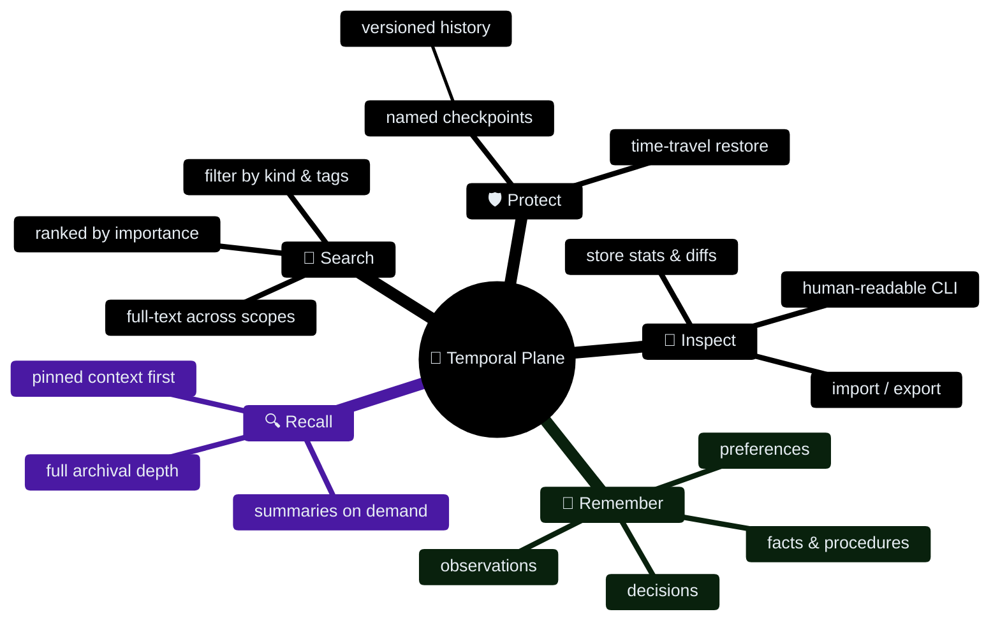
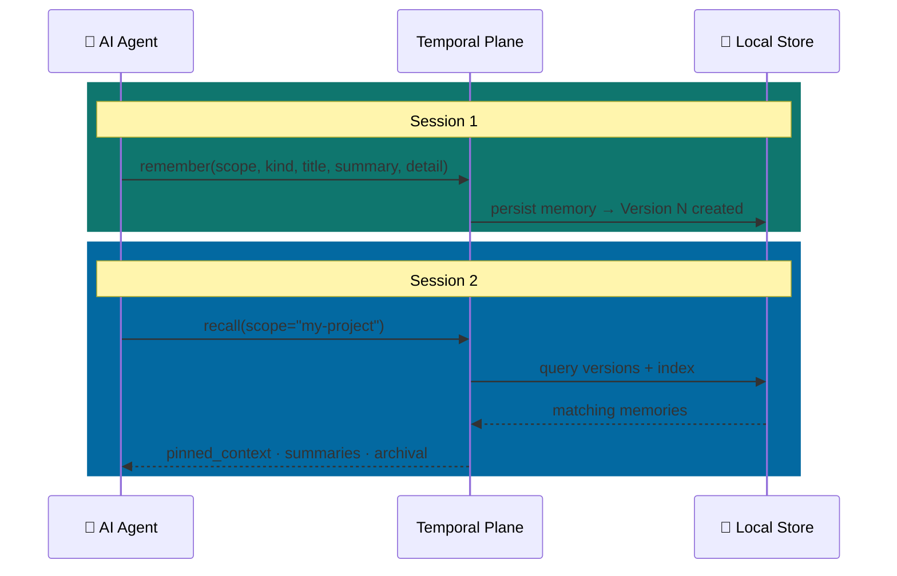
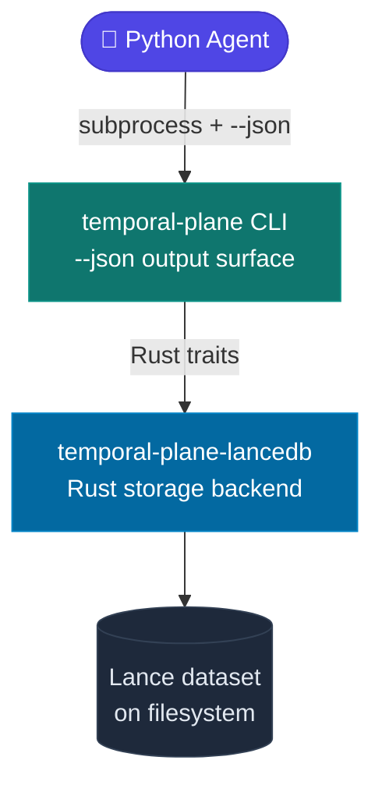

# Temporal Plane

> A lightweight, inspectable, local-first memory engine for AI coding agents — with built-in version history and time-travel.



AI coding agents have no continuous memory. Every session starts cold. Temporal Plane changes that — giving your agent a structured, local memory store that persists between sessions, supports rich retrieval, and lets you inspect, restore, and version everything.

No cloud, no daemon, no configuration sprawl. Just a local store on your filesystem that your agent can write to and read from, with a clean CLI and Python client sitting on top.

---

## How it works

An agent calls `remember` to persist an observation, decision, or fact. Later sessions call `recall` or `search` to retrieve the most relevant context. The full version history of the store is preserved — you can checkpoint before risky operations, list what changed, and restore to any prior state.



Context is returned in **three layers** based on relevance:

| Layer | What it contains | When it loads |
|-------|-----------------|---------------|
| `pinned_context` | Explicitly pinned, always-relevant memories | Always first |
| `summaries` | High-importance and recent distilled memories | By default |
| `archival` | Full historical record | On request |

This **progressive disclosure** pattern means you never flood an agent's context window with noise.

---

## Features

- **Scoped memory** — organize memories by project or context
- **Typed memory kinds** — `observation`, `decision`, `preference`, `summary`, `fact`, `procedure`, `warning`
- **Full-text search** — fast FTS with scope and importance filters
- **Pinned context** — pin critical decisions or preferences to always surface first
- **Version history** — every write creates an immutable version; inspect and browse the full timeline
- **Checkpoints** — named, human-readable stable points in the version history
- **Time-travel restore** — restore the store to any prior version or checkpoint as a new head state
- **Import / export** — portable store archives
- **Store optimization** — compact and prune old data with safety checkpoints built in
- **Human-readable CLI** — inspect the full store state from the terminal
- **Python client** — typed, thin wrapper for use in Python agents and scripts
- **Local-first, no cloud** — runs entirely on your filesystem, zero external dependencies

---

## Quick start

### Install the CLI

Build from source:

```bash
cargo install --path crates/temporal-plane-cli
```

### Initialize a store

```bash
temporal-plane --store .temporal-plane init
```

### Persist a memory

```bash
temporal-plane --store .temporal-plane remember \
  --id mem-001 \
  --scope my-project \
  --kind observation \
  --title "Decided to use LanceDB for local storage" \
  --summary "LanceDB chosen for Arrow-native embedded storage with FTS and versioning." \
  --detail "Evaluated SQLite, DuckDB, and LanceDB. LanceDB wins on versioning and vector support." \
  --importance 80 \
  --tag architecture --tag storage
```

### Recall context

```bash
temporal-plane --store .temporal-plane recall --scope my-project
```

### Search

```bash
temporal-plane --store .temporal-plane search --text "storage decision" --scope my-project
```

### Checkpoint before a risky operation

```bash
temporal-plane --store .temporal-plane checkpoint \
  --name before-refactor \
  --description "Stable state before large codebase restructure"
```

### Restore to a prior state

```bash
temporal-plane --store .temporal-plane restore --checkpoint before-refactor
```

---

## Python client

Install from PyPI:

```bash
pip install temporal-plane
```

> The package does not bundle the CLI binary. Install `temporal-plane` separately and ensure it is on `PATH`, or set `TP_BINARY=/path/to/temporal-plane`.

```python
from pathlib import Path
from temporal_plane import TemporalPlane, RememberRequest

tp = TemporalPlane(store=Path(".temporal-plane"))
tp.init()

tp.remember(RememberRequest(
    id="mem-001",
    scope="my-project",
    kind="decision",
    title="Use LanceDB for local storage",
    summary="LanceDB chosen for Arrow-native embedded storage with FTS and versioning.",
    detail="Evaluated SQLite, DuckDB, and LanceDB. LanceDB wins on versioning and vector support.",
    importance=80,
    tags=["architecture", "storage"],
))

# Retrieve layered context
context = tp.recall()
for entry in context.pinned_context:
    print(f"[pinned] {entry.memory.title}")

# Full-text search
results = tp.search("storage decision", scope="my-project")
for m in results:
    print(f"{m.id}: {m.title} (importance={m.importance})")

# Inspect store stats
stats = tp.stats()
print(f"Total memories: {stats.total_memories}")
```

---

## Memory model

Each memory record has:

| Field | Purpose |
|-------|---------|
| `id` | Stable identifier for this memory |
| `scope` | Project or context namespace |
| `kind` | One of `observation`, `decision`, `preference`, `summary`, `fact`, `procedure`, `warning` |
| `title` | Short human-readable label |
| `summary` | Distilled, compact version of the memory |
| `detail` | Full detail — the complete context |
| `importance` | 0–100 score, controls recall ranking |
| `confidence` | 0–100 score, how certain this memory is |
| `tags` | Free-form labels for filtering and search |
| `entities` | Named entities mentioned in this memory |
| `pin_reason` | If set, this memory is pinned and surfaces first in recall |

---

## Version history and time-travel

Every write creates a new immutable version:

```bash
# List versions
temporal-plane --store .temporal-plane versions

# Create a named checkpoint
temporal-plane --store .temporal-plane checkpoint --name stable-baseline

# Restore the store to a named checkpoint
temporal-plane --store .temporal-plane restore --checkpoint stable-baseline
```

Restore creates a **new head state** from the prior version — it does not discard history.

---

## Repository structure

```
temporal-plane/
├── crates/
│   ├── temporal-plane-core/       # Domain model, traits, typed errors
│   ├── temporal-plane-lancedb/    # LanceDB + Lance storage backend
│   ├── temporal-plane-cli/        # Human-facing CLI with human + JSON output
│   ├── temporal-plane-types/      # Shared value objects and contracts
│   └── temporal-plane-test-support/
├── python/                        # Python package (temporal-plane on PyPI)
│   └── temporal_plane/
├── adapters/
│   └── ai-dx-toolkit/             # AI DX Toolkit adapter proof-of-concept
├── examples/                      # Runnable usage examples
└── docs/                          # Architecture and design documentation
```

### Crate responsibilities

| Crate | Responsibility |
|-------|---------------|
| `temporal-plane-core` | Domain types, traits, typed errors — no storage-specific code |
| `temporal-plane-lancedb` | All LanceDB and Lance storage details, behind core traits |
| `temporal-plane-cli` | CLI parsing, command dispatch, human + JSON output rendering |
| `temporal-plane-types` | Shared value objects and request/response contracts |
| `temporal-plane-test-support` | Deterministic test fixtures — non-production only |

The core crate is intentionally storage-agnostic. LanceDB details never leak into it.

---

## Architecture: the binding strategy

The Python package is a thin subprocess wrapper over the CLI's `--json` output surface. No product logic is duplicated in Python — Rust is the single source of truth.



Direct FFI via PyO3 is planned for a future milestone once the stable Rust API surface is locked.

---

## Roadmap status

| Milestone | Description | Status |
|-----------|-------------|--------|
| 0 | Workspace and engineering baseline | ✅ Done |
| 1 | Core domain contract freeze | ✅ Done |
| 2 | Local LanceDB backend MVP | ✅ Done |
| 3 | Human-first CLI MVP | ✅ Done |
| 4 | Progressive disclosure and pinning semantics | ✅ Done |
| 5 | Version-aware safety features | ✅ Done |
| 6 | Python binding and first adapter | ✅ Done |
| 7 | Advanced storage workflows (branch-aware internals) | ✅ Done |
| — | First PyPI release | 🚀 In progress |

---

## Contributing and engineering baseline

The workspace is configured with:

- stable Rust toolchain pinning via `rust-toolchain.toml`
- `rustfmt` and `clippy` with strict lint defaults
- `cargo-deny` for dependency policy
- `cargo test --workspace` and `cargo doc --workspace` as CI gates

### Run baseline checks

```bash
./scripts/check.sh
```

### Python packaging validation

```bash
./scripts/check-python-package.sh
```

---

## Documentation

- [Architecture and plan](docs/temporal-plane-plan-v3.md)
- [Roadmap and milestones](docs/temporal-plane-roadmap.md)
- [LanceDB Rust SDK agent guide](docs/lancedb-rust-sdk-agent-guide.md)
- [Checkpoint and retention policy](docs/checkpoint-and-retention-policy.md)
- [Versioning and restore](docs/versioning-and-restore.md)
- [Branch lifecycle](docs/branch-lifecycle.md)
- [Python package README](python/README.md)
- [PyPI release plan](docs/pypi-release-plan.md)

---

## License

MIT — see [LICENSE](LICENSE).
