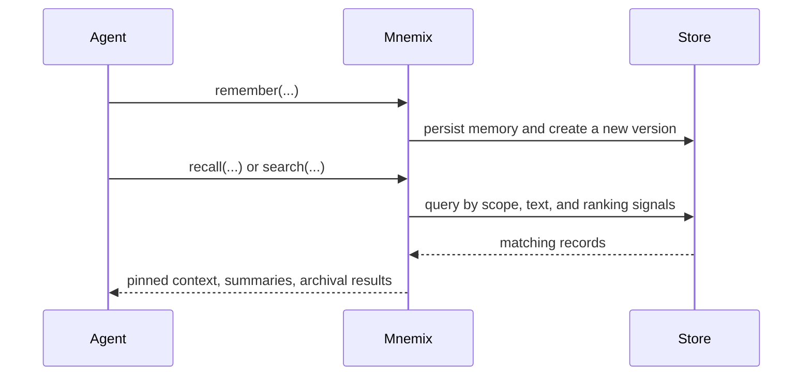

# Mnemix

Mnemix is a local-first memory engine for AI agents and related tools. It gives an agent a durable store for decisions, facts, procedures, summaries, and preferences without requiring a hosted service or background daemon.

The project is built around three ideas:

- memory should be structured, not just a raw transcript dump
- recall should be layered so agents get the smallest useful context first
- history should remain inspectable so restore and recovery are safe

## What Mnemix provides

- scoped memory for repositories, workspaces, or other contexts
- typed memory records for observations, decisions, preferences, facts, procedures, and summaries
- layered recall with pinned context, summaries, and archival expansion
- full-text search across stored memories
- checkpoints and version history for recovery
- a terminal-first CLI with optional JSON output
- a thin Python client built on the CLI contract
- workflow-specific host adapters built on the Python client

## How it works

An agent writes memories to a local store with `remember`. Later sessions use `recall`, `search`, `pins`, or `show` to pull back the right amount of context.



## Retrieval model

Recall is designed to expose the most useful context first:

| Layer | Purpose |
|---|---|
| `pinned_context` | Always-available, intentionally elevated context |
| `summaries` | Compact, high-signal memories for normal recall |
| `archival` | Broader historical matches for deeper inspection |

This progressive disclosure model helps keep context windows focused while preserving access to the full store.

## Quick start

Install from PyPI:

```bash
pip install mnemix
```

Initialize a store:

```bash
mnemix --store .mnemix init
```

Write a memory:

```bash
mnemix --store .mnemix remember \
  --id memory:first-decision \
  --scope repo:mnemix \
  --kind decision \
  --title "Adopt Mnemix for persistent agent memory" \
  --summary "Use a local structured store instead of raw transcript recall." \
  --detail "Mnemix keeps memories inspectable, searchable, and versioned." \
  --importance 85
```

Recall context for the next session:

```bash
mnemix --store .mnemix recall --scope repo:mnemix
```

Search for a specific topic:

```bash
mnemix --store .mnemix search --text "persistent agent memory" --scope repo:mnemix
```

## Interfaces

- The [CLI](/guide/cli) is the primary user-facing interface.
- The [Python client](/guide/python) wraps the CLI's `--json` contract.
- The [Host Adapters](/guide/host-adapters) page shows how to shape recall and writeback for coding, chat, CI, and review workflows.
- The [storage foundation](/guide/lancedb) explains why Mnemix uses LanceDB and Lance underneath.

## Ecosystem

Mnemix is also part of a broader toolchain. For config-driven, multi-platform
generation of AI coding resources, see
[mnemix-context](https://github.com/micahcourey/mnemix-context).

## Next steps

- Read [Memory Model](/guide/memory-model) for the shape of stored records.
- Read [Versioning & Restore](/guide/versioning-and-restore) for recovery semantics.
- Read [Checkpoint & Retention Policy](/guide/checkpoint-and-retention-policy) for safety defaults.
