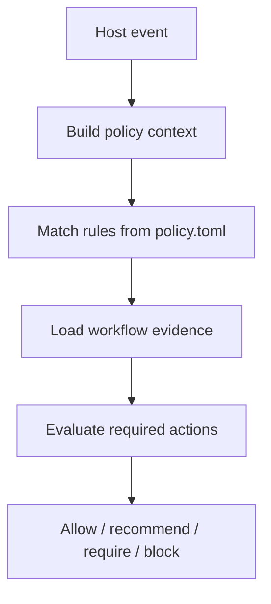

# Policy Runner

Mnemix supports two memory workflow styles:

- `guided`: recommend recall, writeback, or checkpoints when they are likely to add signal
- `required`: require specific memory actions for configured workflow checkpoints

The policy runner is the layer that evaluates those workflow rules. It sits
above the base Mnemix API and above host adapters. It does not change storage
semantics or backend behavior.

## Why it exists

Host adapters already know how to do memory work:

- `CodingAgentAdapter.start_task(...)`
- `CodingAgentAdapter.store_outcome(...)`
- `CiBotAdapter.prepare_run(...)`

What adapters do not decide is whether those actions are mandatory for a given
workflow moment. That decision belongs in a separate policy layer so teams can
choose where memory is optional, recommended, or required.

Typical checkpoints:

- task start
- git commit
- PR open
- review start
- risky migration or bulk edit

## Current v1 surface

The first policy-runner slice is available through the CLI and the Python
client.

CLI commands:

- `mnemix policy check`
- `mnemix policy explain`
- `mnemix policy record`

Python client methods:

- `Mnemix.policy_check(...)`
- `Mnemix.policy_explain(...)`
- `Mnemix.policy_record(...)`

## Config files

The policy runner uses local store files:

```text
.mnemix/
  policy.toml
  policy-state.json
```

`policy.toml` defines the rules.

`policy-state.json` stores workflow evidence such as:

- recall performed
- writeback recorded
- checkpoint created
- skip reason recorded

This state is host/workflow metadata, not part of the core memory schema.

## Rule model

Each rule defines:

- `trigger`
- `mode`
- `requires`
- `when`
- `allow_skip`
- `on_unsatisfied`

Supported v1 modes:

- `guided`
- `required`
- `required_with_skip_reason`

Supported v1 actions:

- `recall`
- `writeback`
- `checkpoint`
- `skip_reason`
- `scope_selected`
- `classification_selected`

## Example config

```toml
version = 1

[defaults]
scope_strategy = "repo"
evidence_ttl = "task"

[[rules]]
id = "task-start-recall"
trigger = "on_task_start"
mode = "guided"
requires = ["recall"]
on_unsatisfied = "allow_with_recommendation"

[rules.when]
host = ["coding-agent"]
task_kinds = ["feature", "bugfix", "refactor", "investigation"]

[[rules]]
id = "commit-writeback"
trigger = "on_git_commit"
mode = "required_with_skip_reason"
requires = ["writeback"]
allow_skip = true
on_unsatisfied = "block"

[rules.when]
host = ["coding-agent"]
paths_any = ["adapters/**", "python/**", "crates/**"]
exclude_paths = ["docs/**", "website/**"]
```

## Evaluation flow



The runner returns a structured decision that includes:

- matched rules
- required actions
- missing actions
- human-readable reasons

## Coding-agent example

A coding workflow can evaluate commit policy before allowing the commit to
continue:

```bash
mnemix --store .mnemix policy check \
  --trigger on_git_commit \
  --workflow-key commit-123 \
  --host coding-agent \
  --path adapters/coding_agent_adapter.py
```

If the workflow later stores a durable outcome, it can record that evidence:

```bash
mnemix --store .mnemix policy record \
  --workflow-key commit-123 \
  --action writeback
```

The same surface is available in Python:

```python
from pathlib import Path

from mnemix import Mnemix
from mnemix.models import PolicyCheckRequest, PolicyRecordRequest

client = Mnemix(store=Path(".mnemix"))

decision = client.policy_check(
    PolicyCheckRequest(
        trigger="on_git_commit",
        workflow_key="commit-123",
        host="coding-agent",
        paths=["adapters/coding_agent_adapter.py"],
    )
)

if decision.decision == "block":
    client.policy_record(
        PolicyRecordRequest(
            workflow_key="commit-123",
            action="writeback",
        )
    )
```

## Relationship to adapters

The policy runner does not replace host adapters.

Use adapters for:

- how to recall
- what to store
- how to classify outcomes

Use the policy runner for:

- when recall is required
- when writeback is required
- when checkpoints are mandatory
- when skip is allowed

## Relationship to MCP

MCP is useful as a future interoperability layer, but it is not the enforcement
boundary.

For strict workflows, enforcement still belongs in host checkpoints such as:

- wrapper commands
- git hooks
- CI checks
- editor or agent orchestrators

## Current limitations

The current implementation is intentionally small:

- local file-backed config and evidence only
- no MCP exposure yet
- no Python helper around policy config authoring
- no git-hook integration yet
- no automatic evidence cleanup or TTL enforcement yet

Those are planned follow-on steps, not part of the current v1 slice.
